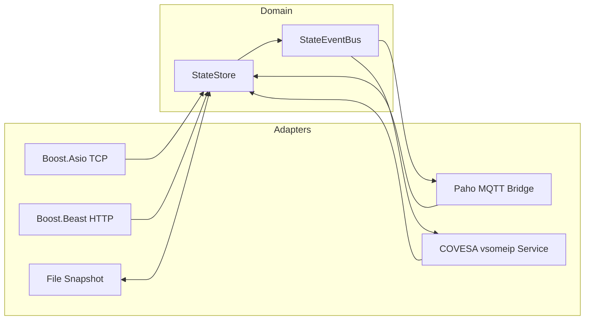
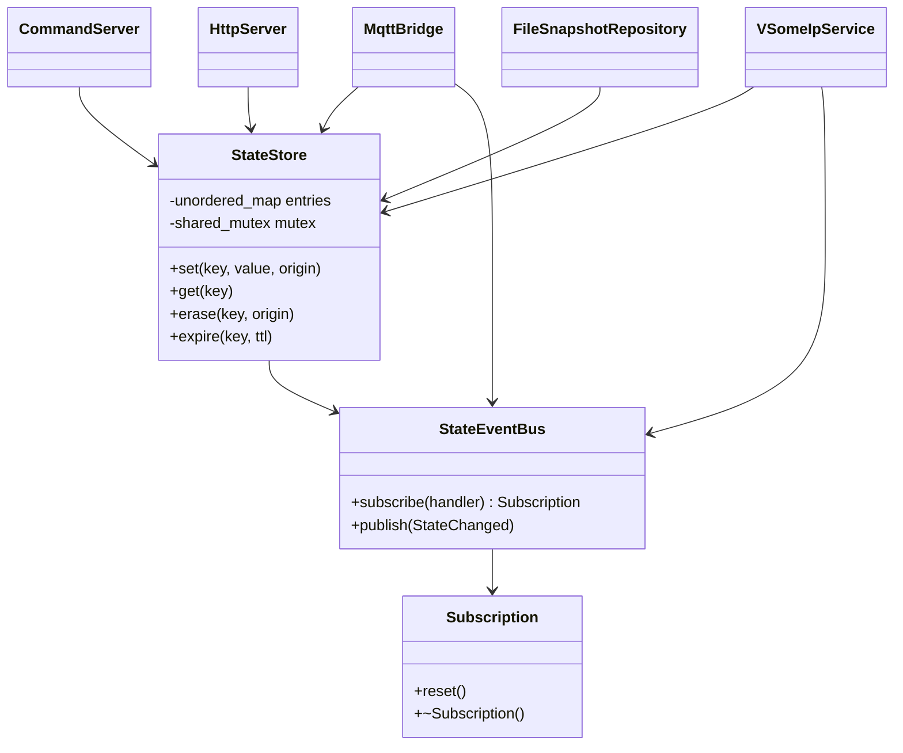
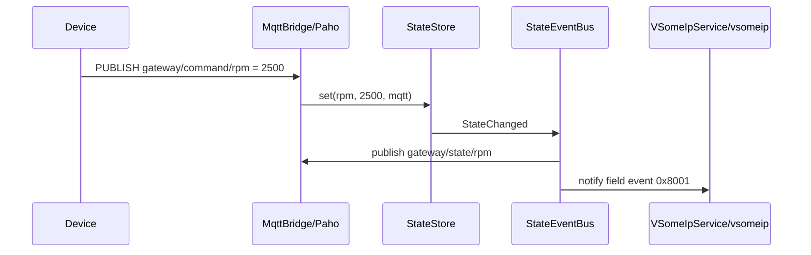

# Kiến trúc C++ Edge Gateway

Nếu mới học UML hoặc muốn xem data flow của từng protocol, đọc
[bộ UML trực quan](UML_GUIDE_VI.md). Tài liệu đó có component, class, sequence,
deployment, thread và lifecycle diagram kèm hướng dẫn cách đọc.

## 1. Nguyên tắc

Domain không include Boost, Paho hoặc vsomeip. Middleware nằm ở adapter ngoài.
Do đó có thể test business state mà không mở socket hay chạy broker/routing
manager.



## 2. Class diagram



## 3. Dependency rule

```text
domain <- application <- adapters/infrastructure <- executable
```

- `domain`: state và domain event.
- `application`: deployment payload codec dùng giữa use case và SOME/IP.
- `adapters`: chuyển API của library thành thao tác domain.
- `infrastructure`: persistence.
- `apps`: composition root và lifecycle.

Không được include header adapter từ domain.

## 4. Data flow

Ví dụ command đến từ MQTT:



## 5. Ownership và thread model

- `main` sở hữu `StateEventBus` trước, rồi `StateStore`, sau đó adapters.
- Boost.Asio `io_context` chạy trên `--threads` worker.
- Paho sở hữu network/callback threads của MQTT.
- `vsomeip::application::start()` chạy blocking trên thread riêng.
- `StateStore` dùng `shared_mutex`.
- `StateEventBus` copy handler list trước khi callback, không giữ global mutex
  trong lúc gọi middleware.
- `Subscription` là RAII token; adapter hủy subscription trước khi middleware
  object bị hủy.

## 6. Vì sao xóa raw stacks?

Tự parse wire format hữu ích như bài tập, nhưng không phải kiến trúc runtime tốt:

- HTTP có nhiều security edge case; Beast đã xử lý message framing.
- MQTT cần reconnect, QoS, inflight token và broker interoperability; Paho đã
  xử lý.
- SOME/IP cần routing manager, SD, endpoint configuration, subscriptions và
  local IPC; vsomeip đã xử lý.

Project chỉ tự sở hữu phần tạo giá trị: domain model, use case, deployment
serialization và mapping giữa protocol với domain.
