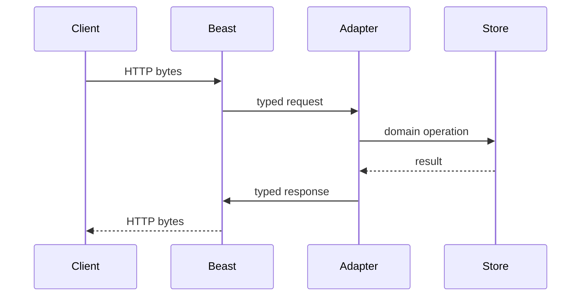
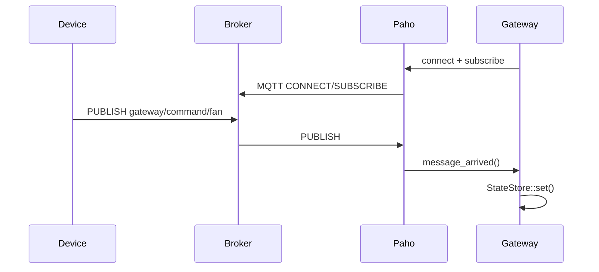
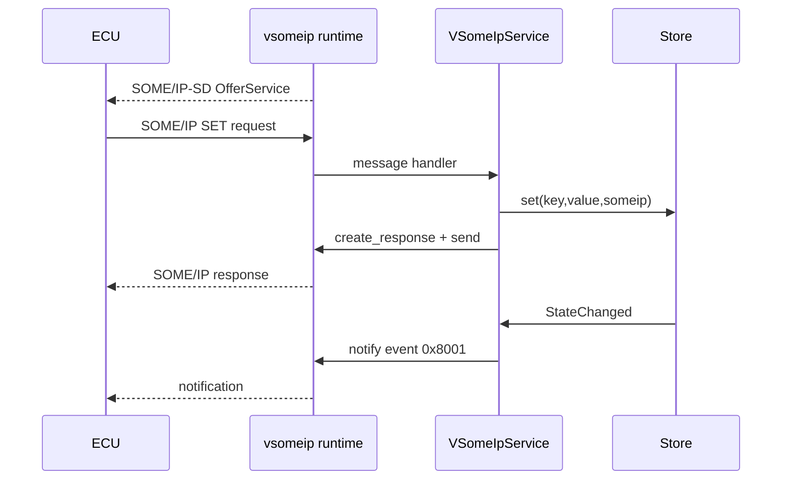

# HTTP, MQTT và SOME/IP

## 1. Protocol và library khác nhau thế nào?

Protocol là hợp đồng trên wire. Library là implementation của hợp đồng đó.
Ta vẫn phải hiểu protocol để cấu hình/debug, nhưng không nên viết lại stack
trong business application.

| Protocol | Mô hình | Library trong project |
|---|---|---|
| HTTP/1.1 | request/response | Boost.Beast |
| MQTT | publish/subscribe | Eclipse Paho MQTT C++ |
| SOME/IP | service/method/event | COVESA vsomeip |

## 2. HTTP

HTTP quản lý resource bằng method, target và status:

```http
PUT /kv/rpm HTTP/1.1
Host: localhost:8080
Content-Length: 4

2500
```

Beast parse TCP bytes thành `http::request<string_body>`. Adapter chỉ route:

| Route | Domain action |
|---|---|
| `GET /health` | liveness |
| `GET /metrics` | `StateStore::size()` |
| `PUT /kv/{key}` | `set(..., http)` |
| `GET /kv/{key}` | `get()` |
| `DELETE /kv/{key}` | `erase(..., http)` |



Học thêm: keep-alive, body limit, TLS, authentication, timeout và request
smuggling. Project không tự parse `Content-Length` hay chunked encoding.

## 3. MQTT

MQTT tách producer và consumer qua broker:

```text
publisher -> PUBLISH topic/payload -> broker -> subscribers
```

Gateway là **MQTT client**, không phải broker:

- subscribe `gateway/command/#`;
- command payload cập nhật `StateStore`;
- publish state event tới `gateway/state/<key>`;
- QoS/reconnect/keepalive do Paho quản lý.



Các khái niệm phải hiểu dù dùng library:

- QoS 0/1/2 và duplicate delivery.
- retained message.
- clean/persistent session.
- Last Will.
- topic wildcard `+` và `#`.
- reconnect và idempotency.

## 4. SOME/IP

SOME/IP mô hình hóa API automotive bằng:

- Service ID.
- Instance ID.
- Method ID cho request/response.
- Event ID + Eventgroup ID cho subscribe/notify.
- major/minor interface version.

Project dùng:

| Identifier | Value |
|---|---:|
| Service | `0x1234` |
| Instance | `0x5678` |
| GET method | `0x0001` |
| SET method | `0x0002` |
| State field event | `0x8001` |
| Eventgroup | `0x0001` |

`VSomeIpService` không tạo socket UDP và không encode SOME/IP header.
`vsomeip::application` chịu trách nhiệm:

- routing manager/local IPC;
- TCP/UDP endpoint;
- SOME/IP header;
- OfferService/StopOffer;
- Service Discovery multicast;
- event/eventgroup subscription;
- response Client ID/Session ID.

Adapter chịu trách nhiệm:

- đăng ký GET/SET message handler;
- deserialize deployment payload;
- gọi `StateStore`;
- tạo response payload;
- gọi `offer_service`, `offer_event`, `send`, `notify`.



### Deployment payload

vsomeip xử lý SOME/IP envelope nhưng payload schema vẫn thuộc service contract.
Project dùng format nhỏ:

```text
string = uint16 big-endian length + UTF-8 bytes
GET request = string(key)
SET request = string(key) + string(value)
GET response = string(value)
event = string(key) + string(value)
```

Trong production, schema này phải đến từ interface/deployment specification,
thường đi cùng Franca IDL/CommonAPI hoặc AUTOSAR model.

## 5. Đọc tiêu chuẩn

- [HTTP/1.1 RFC 9112](https://www.rfc-editor.org/rfc/rfc9112.html)
- [OASIS MQTT 3.1.1](https://docs.oasis-open.org/mqtt/mqtt/v3.1.1/mqtt-v3.1.1.html)
- [AUTOSAR SOME/IP](https://www.autosar.org/fileadmin/standards/R25-11/FO/AUTOSAR_FO_PRS_SOMEIPProtocol.pdf)
- [AUTOSAR SOME/IP-SD](https://www.autosar.org/fileadmin/standards/R25-11/FO/AUTOSAR_FO_PRS_SOMEIPServiceDiscoveryProtocol.pdf)
- [COVESA vsomeip tutorial](https://github.com/COVESA/vsomeip/wiki/vsomeip-in-10-minutes)

