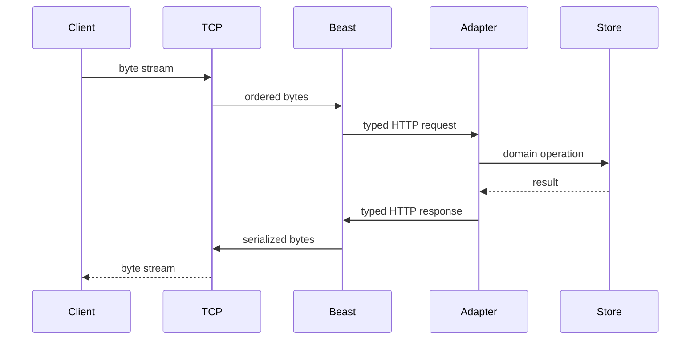

# Nền tảng TCP, HTTP, MQTT và SOME/IP

Tài liệu này dành cho người mới. Mục tiêu không chỉ là biết tên thư viện, mà
là trả lời được bốn câu hỏi cho mỗi công nghệ:

1. Nó giải quyết vấn đề gì?
2. Bản chất và cơ chế hoạt động là gì?
3. Nó nằm ở đâu trong project?
4. Khi lỗi xảy ra, phải suy luận từ tầng nào?

Sau khi đọc phần lý thuyết, xem [bộ UML trực quan](UML_GUIDE_VI.md) để theo dõi
TCP, HTTP, MQTT và SOME/IP qua đúng class, thread và process trong project.

## 1. Bức tranh lớn: dữ liệu đi qua nhiều tầng

Khi một client gửi HTTP request, không có một “gói HTTP” bay thẳng từ chương
trình này sang chương trình kia. Dữ liệu được bọc qua nhiều tầng:

```text
HTTP message:  "GET /health HTTP/1.1..."
        ↓ chia thành byte
TCP stream:    byte có thứ tự, tin cậy
        ↓ chia thành segment
IP packet:     mang dữ liệu từ IP nguồn tới IP đích
        ↓ đóng thành frame
Ethernet/Wi-Fi: truyền trên mạng vật lý
```

Phía nhận mở các lớp theo chiều ngược lại. Vì vậy:

- IP trả lời câu hỏi “đi tới máy nào?”.
- TCP trả lời “hai tiến trình truyền một dòng byte tin cậy thế nào?”.
- HTTP trả lời “dòng byte đó biểu diễn request/response web ra sao?”.
- MQTT trả lời “publisher và subscriber trao đổi message qua broker ra sao?”.
- SOME/IP trả lời “service automotive gọi method và phát event ra sao?”.
- Boost.Asio, Beast, Paho và vsomeip là **library**, không phải protocol.

### Protocol khác library

**Protocol** là hợp đồng giữa hai đầu giao tiếp: format byte, thứ tự message,
ý nghĩa field và hành vi khi lỗi. **Library** là code giúp application thực thi
hợp đồng đó.

| Hợp đồng | Mô hình | Library project dùng |
|---|---|---|
| TCP | reliable byte stream | Boost.Asio |
| HTTP/1.1 | request/response resource | Boost.Beast |
| MQTT | publish/subscribe qua broker | Eclipse Paho MQTT C++ |
| SOME/IP | service/method/event | COVESA vsomeip |

Mẹo nhớ: **protocol là ngôn ngữ; library là người phiên dịch**. Hai chương
trình có thể dùng hai library khác nhau mà vẫn nói chuyện được nếu cùng tuân
theo một protocol.

## 2. TCP — đường ống byte tin cậy

### 2.1 TCP dùng để làm gì?

IP có thể làm mất packet, giao packet sai thứ tự hoặc giao trùng. TCP tạo cho
application cảm giác đang dùng một đường ống hai chiều:

- byte đến đúng thứ tự;
- byte mất sẽ được truyền lại;
- byte lỗi được phát hiện;
- bên gửi không làm bên nhận quá tải nhờ flow control;
- lưu lượng tự giảm khi mạng nghẽn nhờ congestion control.

TCP là **connection-oriented**: trước khi truyền application data, hai đầu tạo
connection. Một connection được nhận diện bởi bộ bốn:

```text
(source IP, source port, destination IP, destination port)
```

Server thường lắng nghe trên một port cố định; client dùng một ephemeral port
do hệ điều hành chọn. Port xác định tiến trình/dịch vụ trên một máy, không phải
xác định máy.

### 2.2 Bắt tay và đóng kết nối

Ba bước mở connection thường được nhớ là:

```text
Client                         Server
  | -------- SYN ------------> |
  | <----- SYN + ACK ---------- |
  | -------- ACK -------------> |
  |       connection ready      |
```

Sequence number giúp TCP sắp thứ tự và phát hiện phần dữ liệu thiếu. ACK xác
nhận byte đã nhận. Khi đóng bình thường, mỗi chiều được đóng độc lập bằng
FIN/ACK; `RST` là ngắt đột ngột.

Đi phỏng vấn không nên chỉ nói “TCP bắt tay ba bước”. Hãy nói mục đích của nó:
hai đầu xác nhận khả năng liên lạc và đồng bộ trạng thái/sequence number trước
khi trao đổi dữ liệu.

### 2.3 TCP không có ranh giới message

Đây là bản chất quan trọng nhất khi viết server:

```text
send("SET rpm ")
send("2500\n")
```

Phía nhận có thể đọc thành `"SET rpm 2500\n"`, hoặc `"SET r"` rồi
`"pm 2500\n"`. Một lần `send` **không tương ứng** một lần `read`. TCP chỉ bảo
toàn thứ tự byte, không bảo toàn ranh giới message.

Application phải tự định nghĩa **framing**, ví dụ:

- kết thúc message bằng newline;
- đặt độ dài trước payload;
- dùng fixed-size message;
- dùng protocol có framing sẵn như HTTP.

TCP command server trong project chọn newline:

```text
SET rpm 2500\n
GET rpm\n
DEL rpm\n
```

`async_read_until(..., '\n')` gom byte tới khi gặp newline. Đây là framing của
command protocol do project định nghĩa, không phải tính năng message của TCP.

### 2.4 Stream, socket, acceptor và event loop

- **Socket** là handle hệ điều hành đại diện cho một endpoint.
- **Acceptor/listening socket** nghe port và tạo socket mới cho từng client.
- **Connection socket** truyền dữ liệu với đúng một peer.
- **`io_context`** là event loop chạy callback khi I/O hoàn tất.
- **Asynchronous I/O** đăng ký công việc rồi trả quyền điều khiển ngay, không
  giữ một thread đứng chờ từng client.

Luồng trong `src/adapters/tcp/command_server.cpp`:

```text
CommandServer::start
  → async_accept
  → tạo Session cho client
  → async_read_until newline
  → parse command
  → gọi StateStore
  → async_write response
  → đọc command kế tiếp
```

`Session` dùng `shared_from_this()` vì callback có thể chạy sau khi hàm khởi
tạo đã kết thúc. Object phải còn sống cho đến khi asynchronous operation hoàn
tất. Đây là câu hỏi C++/Asio phỏng vấn rất phổ biến.

### 2.5 TCP bảo đảm gì và không bảo đảm gì?

TCP bảo đảm:

- dữ liệu đúng thứ tự, không trùng đối với application;
- phát hiện connection hỏng khi cơ chế timeout/lỗi mạng đủ để kết luận;
- kiểm soát luồng và tắc nghẽn.

TCP không bảo đảm:

- message boundary;
- latency thấp cố định;
- peer thực sự là ai;
- dữ liệu được mã hóa;
- application đã xử lý dữ liệu chỉ vì TCP đã ACK.

TLS bổ sung mã hóa, integrity và authentication. Application protocol vẫn cần
timeout, giới hạn kích thước, xác thực và idempotency.

### 2.6 TCP và UDP

| TCP | UDP |
|---|---|
| Có connection | Connectionless |
| Reliable, ordered byte stream | Best-effort datagram |
| Không giữ message boundary | Giữ datagram boundary |
| Retransmission trong transport | Application tự quyết định |
| Head-of-line blocking | Packet sau không phải chờ packet trước |

Không nên kết luận đơn giản “TCP tốt, UDP nhanh”. Lựa chọn phụ thuộc việc mất
gói, độ trễ, kích thước message và cơ chế reliability của application.

### Câu hỏi tự kiểm tra TCP

1. Vì sao một lần `send()` có thể cần nhiều lần `read()`?
2. Listening socket khác connection socket thế nào?
3. TCP ACK có chứng minh business logic đã xử lý request không?
4. Tại sao callback Asio thường capture `shared_ptr`?
5. TCP đã reliable rồi, tại sao application vẫn cần timeout?

## 3. HTTP — ngôn ngữ request/response cho resource

### 3.1 HTTP dùng để làm gì?

TCP chỉ chuyển byte; nó không biết byte nào là method, URL, header, body hay
lỗi. HTTP đặt cấu trúc và ngữ nghĩa lên dòng byte để client và server thống
nhất cách thao tác với **resource**.

Ví dụ resource `rpm` được nhận diện bởi `/kv/rpm`:

```http
PUT /kv/rpm HTTP/1.1
Host: localhost:8080
Content-Length: 4

2500
```

Message gồm:

1. start-line: method, request target và version;
2. headers: metadata;
3. dòng trống;
4. body tùy chọn.

Server trả:

```http
HTTP/1.1 200 OK
Content-Length: 4

2500
```

HTTP là application protocol. HTTP/1.1 trong project chạy trên TCP. HTTP/3
chạy trên QUIC/UDP, cho thấy “HTTP” và “TCP” không phải một khái niệm.

### 3.2 Resource, method và status code

Method diễn tả ý định:

- `GET`: đọc representation của resource; safe và idempotent.
- `PUT`: tạo/thay thế resource tại URI đã biết; idempotent.
- `POST`: yêu cầu server xử lý/tạo subordinate resource; không mặc định
  idempotent.
- `DELETE`: xóa resource; có tính idempotent về intended effect.

**Idempotent** nghĩa là gửi cùng request nhiều lần có intended effect giống
gửi một lần. Nó không có nghĩa response luôn giống nhau.

Status code được chia nhóm:

- `2xx`: thành công (`200`, `201`, `204`);
- `3xx`: chuyển hướng/cache;
- `4xx`: request phía client có vấn đề (`400`, `404`, `409`);
- `5xx`: server không hoàn thành được request (`500`, `503`).

Không nên trả `200 OK` cho mọi tình huống rồi giấu lỗi trong body, vì client,
proxy và monitoring dựa vào semantics của status code.

### 3.3 HTTP giải quyết framing thế nào?

Vì TCP không có message boundary, HTTP/1.1 phải tự mô tả độ dài body:

- `Content-Length`;
- `Transfer-Encoding: chunked`;
- một số response không được có body;
- đóng connection trong các trường hợp legacy.

Sai khác giữa proxy và server khi hiểu framing có thể gây request smuggling.
Đó là lý do project dùng Beast để parse thay vì tự tách chuỗi.

`Host` là bắt buộc trong HTTP/1.1 để một IP/port phục vụ nhiều virtual host.
Keep-alive cho phép nhiều request tuần tự trên một TCP connection, giảm chi phí
handshake.

### 3.4 HTTP stateless nghĩa là gì?

Mỗi request phải mang đủ thông tin cần để xử lý; server không được mặc định
request sau phụ thuộc trạng thái giao thức bí mật của request trước. Server vẫn
có thể giữ business state, session hoặc database. “HTTP stateless” không có
nghĩa “server không lưu dữ liệu”.

### 3.5 Mapping vào project

| Route | Ý nghĩa | Domain action |
|---|---|---|
| `GET /health` | process còn phục vụ | liveness response |
| `GET /metrics` | số entry hiện có | `StateStore::size()` |
| `PUT /kv/{key}` | đặt giá trị key | `set(..., http)` |
| `GET /kv/{key}` | đọc key | `get()` |
| `DELETE /kv/{key}` | xóa key | `erase(..., http)` |



Beast chịu trách nhiệm cú pháp HTTP và framing. `HttpServer` vẫn chịu trách
nhiệm route, validation, domain mapping, body limit và deadline.

### 3.6 HTTP không tự cung cấp những gì?

- HTTPS/TLS mới cung cấp mã hóa và xác thực transport.
- Authentication xác định người gọi; authorization xác định họ được làm gì.
- Retry phải xét idempotency.
- Timeout cần ở connect, read, write và toàn request.
- API contract cần quy định schema, status và versioning.

### Câu hỏi tự kiểm tra HTTP

1. HTTP khác TCP ở tầng trách nhiệm nào?
2. `PUT` khác `POST` chủ yếu ở semantics và idempotency ra sao?
3. Vì sao HTTP/1.1 cần `Content-Length` hoặc chunked encoding?
4. Stateless có cấm server dùng database không?
5. Beast xử lý phần nào, adapter project vẫn phải xử lý phần nào?

## 4. MQTT — phân phối message qua broker

### 4.1 MQTT giải quyết vấn đề gì?

Nếu mọi device kết nối trực tiếp với mọi consumer, số kết nối và dependency
tăng nhanh. MQTT tách hai phía bằng broker:

```text
publisher ── PUBLISH(topic, payload) ──> broker
subscriber <── message theo subscription ─ broker
```

Publisher không cần biết subscriber là ai hoặc có online không. Hai phía thống
nhất bằng topic và payload contract. MQTT phù hợp telemetry, IoT command và
event distribution; nó không mặc định là REST API hay database.

Gateway trong project là **MQTT client**, không phải broker:

- subscribe `gateway/command/#`;
- callback nhận command rồi cập nhật `StateStore`;
- publish event tới `gateway/state/<key>`;
- Paho quản lý MQTT packets, network loop và token.

### 4.2 Topic và wildcard

Topic có nhiều level ngăn bởi `/`:

```text
gateway/state/rpm
```

- `+` khớp đúng một level: `gateway/state/+`.
- `#` khớp phần còn lại và chỉ đứng cuối: `gateway/command/#`.

Topic không định nghĩa payload. Team vẫn phải thống nhất payload là text,
JSON, Protobuf hay schema khác.

### 4.3 QoS không phải “chất lượng càng cao càng tốt”

| QoS | Delivery contract | Đánh đổi |
|---:|---|---|
| 0 | at most once | nhẹ, có thể mất |
| 1 | at least once | có thể giao trùng |
| 2 | exactly once trong phiên MQTT | nhiều packet/state hơn |

QoS 1 rất phổ biến. Consumer phải idempotent hoặc deduplicate vì duplicate là
hành vi hợp lệ, không phải broker bị lỗi. “Exactly once” của MQTT không tự đảm
bảo business transaction/database chỉ chạy đúng một lần.

### 4.4 Retained, session và Last Will

- **Retained message**: broker giữ message cuối của topic và gửi ngay cho
  subscriber mới. Nó là last known value, không phải lịch sử.
- **Persistent session**: broker giữ subscription và một số pending message
  khi client offline, tùy version/configuration.
- **Keep Alive**: phát hiện connection im lặng quá lâu.
- **Last Will**: broker phát message đã đăng ký nếu client mất kết nối bất
  thường, thường dùng báo offline.

### Câu hỏi tự kiểm tra MQTT

1. Broker giúp publisher và subscriber decouple theo những chiều nào?
2. Vì sao QoS 1 yêu cầu consumer xử lý duplicate?
3. Retained message khác persistent session thế nào?
4. Gateway này là broker hay client? Dấu hiệu nào trong code chứng minh?

## 5. SOME/IP — RPC và event cho hệ thống automotive

### 5.1 SOME/IP dùng để làm gì?

Trong xe, một ECU có thể cung cấp chức năng cho ECU khác, ví dụ trạng thái
vehicle, climate control hoặc diagnostics. SOME/IP biểu diễn chức năng dưới
dạng service:

- **method**: client gửi request, service trả response;
- **event**: service chủ động notify subscriber;
- **field**: trạng thái có getter/setter/notifier tùy thiết kế.

Tên đầy đủ là Scalable service-Oriented MiddlewarE over IP. SOME/IP là
application-layer protocol, có thể dùng TCP hoặc UDP cho SOME/IP message.

### 5.2 Các định danh

| ID | Trả lời câu hỏi |
|---|---|
| Service ID | Đây là loại dịch vụ nào? |
| Instance ID | Đây là instance cụ thể nào của dịch vụ? |
| Method ID | Đang gọi operation nào? |
| Event ID | Notification nào đang được phát? |
| Eventgroup ID | Client subscribe nhóm event nào? |
| Client ID + Session ID | Request/response nào thuộc về nhau? |

Project dùng:

| Identifier | Value |
|---|---:|
| Service | `0x1234` |
| Instance | `0x5678` |
| GET method | `0x0001` |
| SET method | `0x0002` |
| State field event | `0x8001` |
| Eventgroup | `0x0001` |

Service ID giống “loại API”; Instance ID giống “đối tượng triển khai cụ thể”.
Hai instance có thể cung cấp cùng interface nhưng ở endpoint khác nhau.

### 5.3 SOME/IP và SOME/IP-SD là hai vai trò

**SOME/IP** mang request, response, error và notification.

**SOME/IP Service Discovery (SD)** giúp:

- service thông báo `OfferService`;
- client tìm `FindService`;
- client subscribe/unsubscribe eventgroup;
- service quản lý TTL và endpoint subscription.

Ẩn dụ dễ nhớ: **SD là danh bạ và lễ tân; SOME/IP là cuộc hội thoại sau khi đã
tìm thấy nhau**.

```text
Service                               Client
   | -- SD OfferService ------------> |
   | <---- SD Subscribe Eventgroup -- |
   | -- SD Subscribe ACK -----------> |
   | <---- SOME/IP method request ---- |
   | ----- SOME/IP response --------> |
   | ----- SOME/IP notification ----> |
```

SD thường dùng UDP multicast để tìm nhau; dữ liệu service có thể dùng TCP hoặc
UDP theo deployment configuration. Multicast SD không có nghĩa mọi SOME/IP
payload đều multicast.

### 5.4 Header và payload

SOME/IP envelope chứa các thông tin như service, method/event, length, client,
session, protocol/interface version, message type và return code. Header giúp
middleware route/correlate message.

**SOME/IP không tự biết ý nghĩa business của payload.** Schema payload thuộc
interface/deployment contract. Project dùng schema minh họa:

```text
string       = uint16 big-endian length + UTF-8 bytes
GET request  = string(key)
SET request  = string(key) + string(value)
GET response = string(value)
event        = string(key) + string(value)
```

Hai ECU có ID đúng nhưng encode payload khác nhau vẫn không giao tiếp đúng.
Production thường sinh binding từ Franca IDL/CommonAPI hoặc AUTOSAR model.

### 5.5 SOME/IP khác vsomeip

- **SOME/IP**: specification trên wire.
- **vsomeip**: C++ middleware của COVESA triển khai routing, SOME/IP/SD,
  endpoint, local IPC và API cho application.
- **`VSomeIpService`**: adapter riêng của project dùng API vsomeip để nối với
  `StateStore`.

Mẹo nhớ: **SOME/IP là luật; vsomeip là bộ máy thi hành; `VSomeIpService` là
code nghiệp vụ tích hợp bộ máy đó**.

vsomeip xử lý:

- routing manager và local IPC;
- TCP/UDP endpoints;
- SOME/IP header;
- Offer/Find Service và SD;
- eventgroup subscription;
- correlation Client ID/Session ID.

Adapter project xử lý:

- đăng ký GET/SET handler;
- decode/encode payload contract;
- gọi `StateStore`;
- chọn return code;
- offer service/event và phát notification.

### 5.6 Reliability và lựa chọn TCP/UDP trong SOME/IP

Trong cấu hình vsomeip, endpoint `reliable` thường là TCP và `unreliable`
thường là UDP. “Unreliable” là thuật ngữ transport, không có nghĩa thiết kế
cẩu thả.

- TCP hợp với payload lớn hoặc cần ordered reliable delivery.
- UDP tránh connection/head-of-line nhưng phải chấp nhận giới hạn/loss hoặc có
  cơ chế bổ sung.
- SD dùng timer, repetition và TTL vì announcement UDP có thể mất.

### Câu hỏi tự kiểm tra SOME/IP

1. Service ID và Instance ID khác nhau thế nào?
2. Method, event và field khác nhau thế nào?
3. SOME/IP-SD giải quyết vấn đề gì?
4. vsomeip có định nghĩa payload business cho project không?
5. Tại sao `create_response(request)` quan trọng?
6. SD dùng multicast có đồng nghĩa service payload cũng multicast không?

## 6. So sánh để tránh học thuộc rời rạc

| Góc nhìn | TCP | HTTP | MQTT | SOME/IP |
|---|---|---|---|---|
| Tầng | Transport | Application | Application | Application |
| Đơn vị app thấy | byte stream | request/response | topic message | method/event |
| Trung gian | không | proxy tùy chọn | broker bắt buộc | routing/SD middleware |
| Discovery | DNS/app tự làm | DNS/service registry | biết broker address | SOME/IP-SD |
| Phong cách | connection | resource API | pub/sub | service-oriented RPC/event |
| Library repo | Asio | Beast | Paho | vsomeip |

Một state update trong gateway có thể đi qua nhiều “ngôn ngữ”:

```text
HTTP PUT /kv/rpm
  → HttpServer hiểu HTTP
  → StateStore lưu rpm
  → StateEventBus phát domain event
  → MqttBridge publish gateway/state/rpm
  → VSomeIpService notify event 0x8001
```

Domain event không phải MQTT message hay SOME/IP event. Adapter chuyển một ý
nghĩa domain sang representation phù hợp từng protocol.

## 7. Cách trả lời phỏng vấn có chiều sâu

Dùng khung bốn bước thay vì đọc định nghĩa:

1. **Problem**: công nghệ giải quyết vấn đề nào?
2. **Mechanism**: cơ chế và data flow chính?
3. **Guarantee/trade-off**: bảo đảm gì, không bảo đảm gì?
4. **Project evidence**: code này dùng nó ở đâu và vì sao?

Ví dụ:

> TCP cung cấp ordered reliable byte stream giữa hai endpoint. Nó dùng sequence
> number, ACK và retransmission, nhưng không giữ message boundary; vì vậy
> command server của project dùng newline framing với `async_read_until`.
> Asio cung cấp async socket API, còn TCP mới là protocol. TCP cũng không cung
> cấp encryption hay xác nhận business logic đã xử lý request.

Câu trả lời này cho thấy hiểu bản chất, giới hạn và liên hệ thực tế.

## 8. Thực hành quan sát thay vì chỉ đọc

```bash
# Gửi command TCP; nhấn Enter tạo newline framing
nc 127.0.0.1 6379

# Xem nguyên request/response HTTP
curl -v -X PUT http://127.0.0.1:8080/kv/rpm --data '2500'
curl -v http://127.0.0.1:8080/kv/rpm

# Theo dõi mọi state MQTT
mosquitto_sub -v -t 'gateway/state/#'

# Phát command MQTT
mosquitto_pub -t 'gateway/command/fan' -m 'on' -q 1
```

Khi thực hành, hãy dự đoán trước: connection nào được tạo, byte/message được
frame thế nào, adapter nào nhận, domain state đổi ở đâu, event nào phát ra.

## 9. Tài liệu chuẩn để tra cứu

- [TCP RFC 9293](https://www.rfc-editor.org/rfc/rfc9293.html)
- [HTTP Semantics RFC 9110](https://www.rfc-editor.org/rfc/rfc9110.html)
- [HTTP/1.1 RFC 9112](https://www.rfc-editor.org/rfc/rfc9112.html)
- [OASIS MQTT 3.1.1](https://docs.oasis-open.org/mqtt/mqtt/v3.1.1/mqtt-v3.1.1.html)
- [AUTOSAR SOME/IP](https://www.autosar.org/fileadmin/standards/R25-11/FO/AUTOSAR_FO_PRS_SOMEIPProtocol.pdf)
- [AUTOSAR SOME/IP-SD](https://www.autosar.org/fileadmin/standards/R25-11/FO/AUTOSAR_FO_PRS_SOMEIPServiceDiscoveryProtocol.pdf)
- [COVESA vsomeip wiki](https://github.com/COVESA/vsomeip/wiki)
