# UML trực quan cho C++ Edge Gateway

Tài liệu này biến source code thành các hình dễ đọc. Không cần thuộc ký hiệu UML
trước. Hãy bắt đầu bằng câu hỏi ghi ngay trên mỗi sơ đồ.

## 1. Cách đọc sơ đồ

| Ký hiệu | Cách hiểu |
|---|---|
| Hộp | Một component, class, process hoặc object |
| Mũi tên `A → B` | A gọi, gửi dữ liệu hoặc phụ thuộc B |
| Nét thời gian từ trên xuống | Việc phía trên xảy ra trước việc phía dưới |
| `*--` trong class diagram | Sở hữu mạnh; object con sống cùng object cha |
| `o--` | Giữ/tham chiếu nhưng lifecycle có thể độc lập |
| `..>` | Chỉ sử dụng, không sở hữu |

Một sơ đồ không thể trả lời mọi câu hỏi. Component diagram cho biết các khối
liên hệ thế nào; class diagram cho biết cấu trúc code; sequence diagram cho biết
thứ tự chạy; deployment diagram cho biết process nằm ở máy nào.

## 2. Toàn hệ thống — dữ liệu đi đâu?

Câu hỏi cần trả lời: “Một request từ bên ngoài vào gateway rồi đi ra protocol
khác như thế nào?”

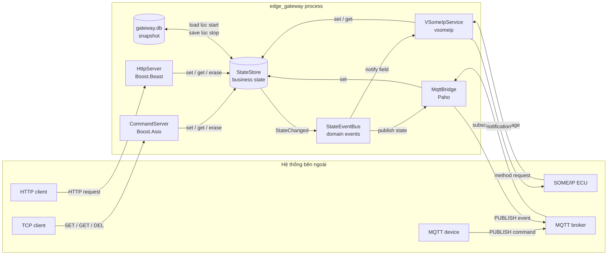

Điểm cần nhớ:

- Mọi input adapter hội tụ tại `StateStore`.
- `StateStore` không gửi MQTT hay SOME/IP trực tiếp; nó phát `StateChanged`.
- Output adapter subscribe `StateEventBus` rồi chuyển domain event sang
  protocol tương ứng.
- Broker nằm ngoài gateway. `MqttBridge` chỉ là MQTT client.

## 3. Các tầng phụ thuộc — vì sao domain không include middleware?

Câu hỏi cần trả lời: “Code tầng nào được phép biết tầng nào?”

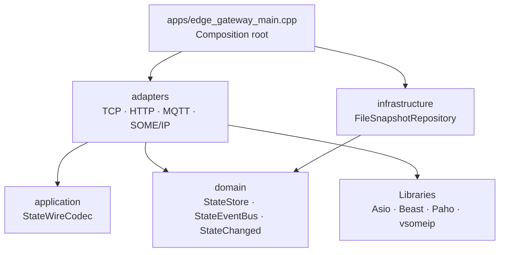

Mũi tên là hướng phụ thuộc source code. Domain nằm trong cùng và không biết
Boost, Paho hay vsomeip. `application/StateWireCodec` cũng độc lập với
middleware. Vì thế core test chạy được mà không cần network.

## 4. Class diagram — ai sở hữu và gọi ai?

Câu hỏi cần trả lời: “Các class chính liên hệ với nhau thế nào?”

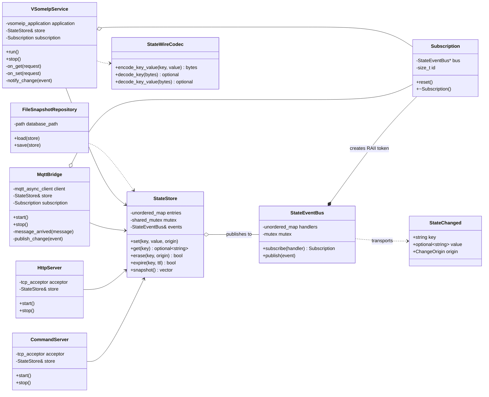

`Subscription` là RAII token: khi token bị hủy/reset, handler được gỡ khỏi
event bus. Điều này ngăn bus callback vào adapter đã bị hủy.

## 5. TCP sequence — một command thực sự được đọc thế nào?

Câu hỏi cần trả lời: “Vì sao TCP cần newline framing?”

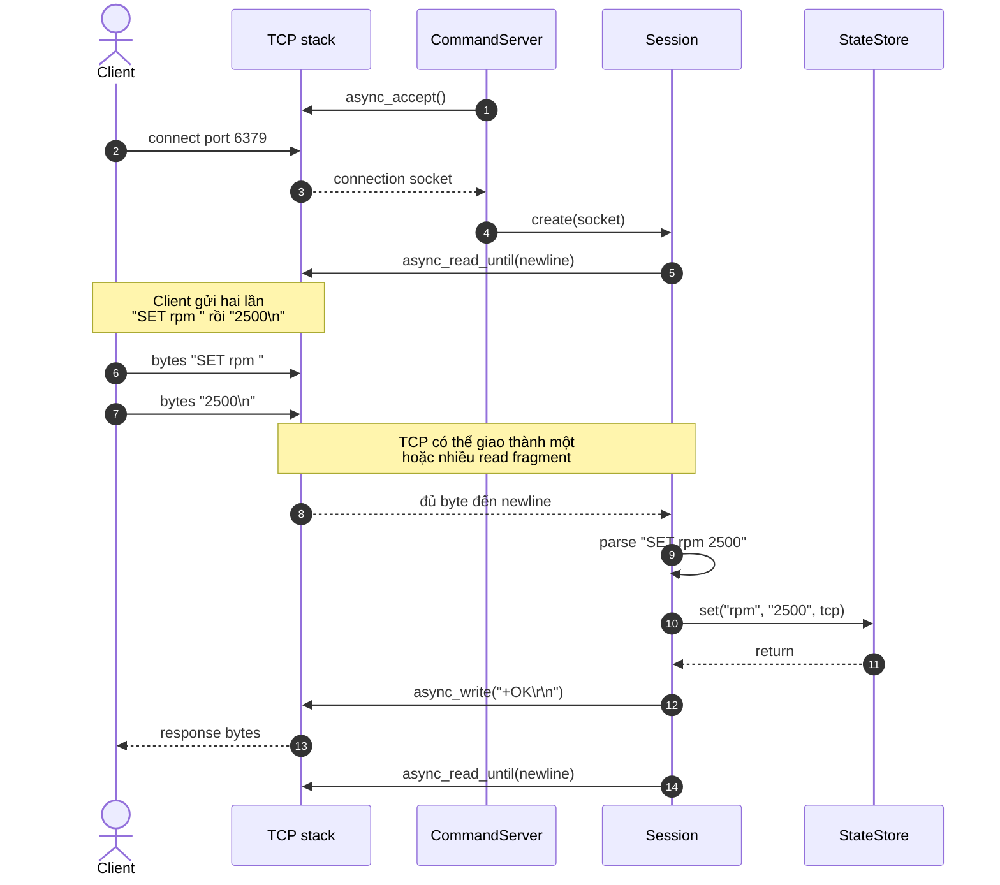

Thông tin phải nhớ: hai lần client `send` không bắt buộc thành hai lần server
`read`. `async_read_until` tạo message boundary bằng newline.

## 6. HTTP sequence — HTTP nằm trên TCP ở đâu?

Câu hỏi cần trả lời: “TCP, Beast, adapter và domain chia việc ra sao?”

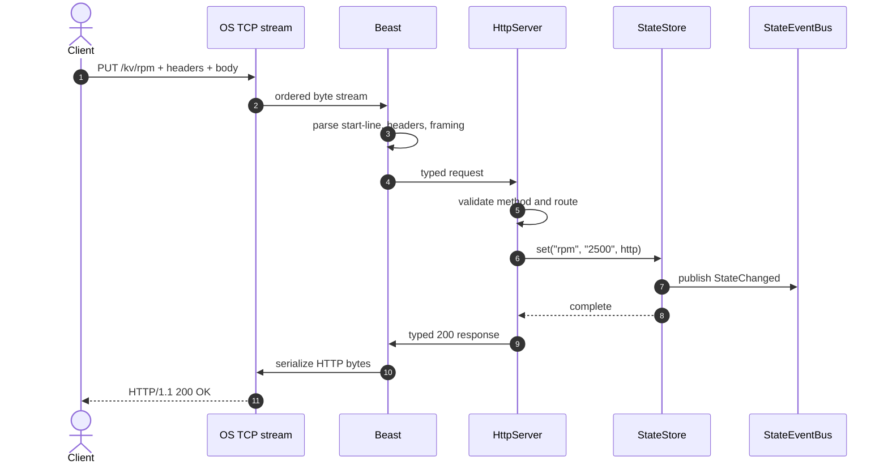

TCP chỉ bảo toàn dòng byte. Beast hiểu cú pháp HTTP. `HttpServer` hiểu route và
mapping nghiệp vụ. `StateStore` không biết request đến từ Beast.

## 7. MQTT sequence — broker đứng ở đâu?

Câu hỏi cần trả lời: “Command MQTT đi vào và state event đi ra thế nào?”

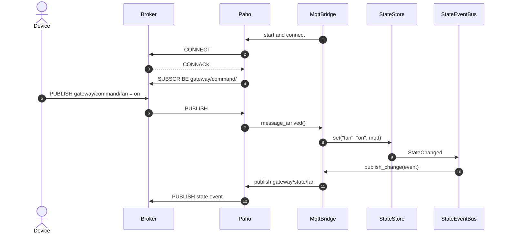

Broker định tuyến theo topic. `StateEventBus` định tuyến domain event trong
process. Hai thành phần cùng có ý tưởng phân phối, nhưng không phải một thứ.

## 8. SOME/IP sequence — discovery, method và event

Câu hỏi cần trả lời: “Offer, request/response và subscribe khác nhau ở đâu?”

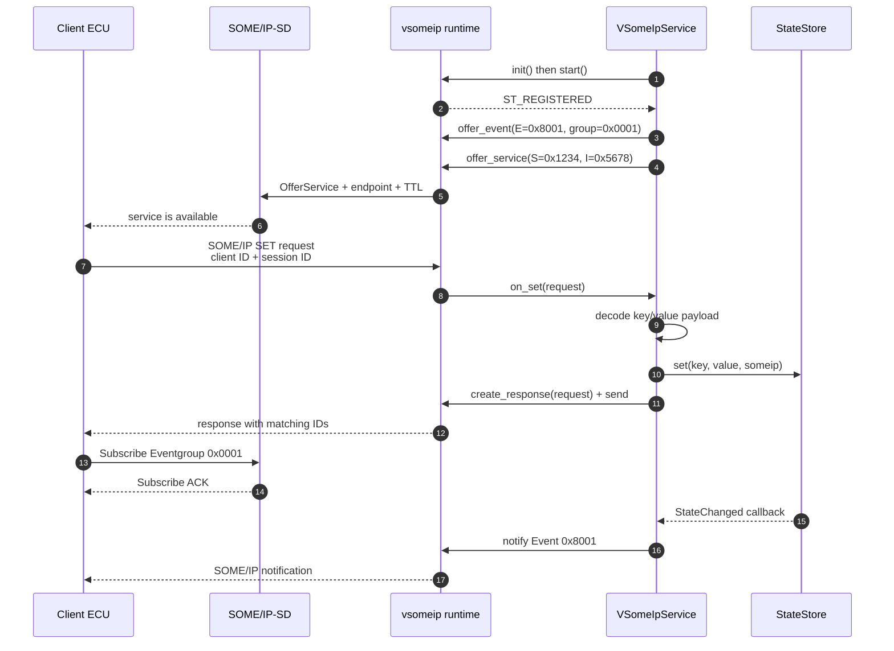

Ba pha độc lập:

1. SD giúp client tìm endpoint.
2. SOME/IP request/response thực hiện method.
3. Event chỉ đến sau khi client subscribe đúng eventgroup.

## 9. Deployment diagram — localhost khác hai ECU thế nào?

Câu hỏi cần trả lời: “Component chạy ở process/máy nào?”

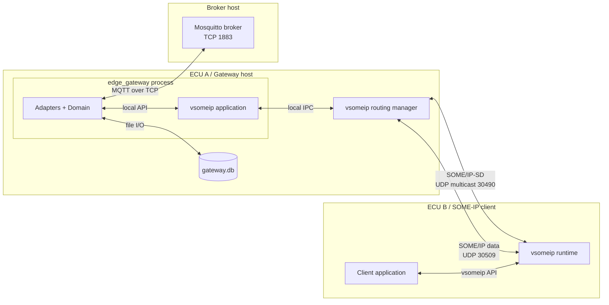

Trong config hiện tại, gateway cũng là routing manager và dùng loopback. Khi
chạy hai ECU thật, multicast route, interface, firewall và unicast address mới
tham gia. Local IPC pass không chứng minh remote network đã đúng.

## 10. Thread model — callback có thể chạy ở đâu?

Câu hỏi cần trả lời: “Vì sao domain phải thread-safe?”

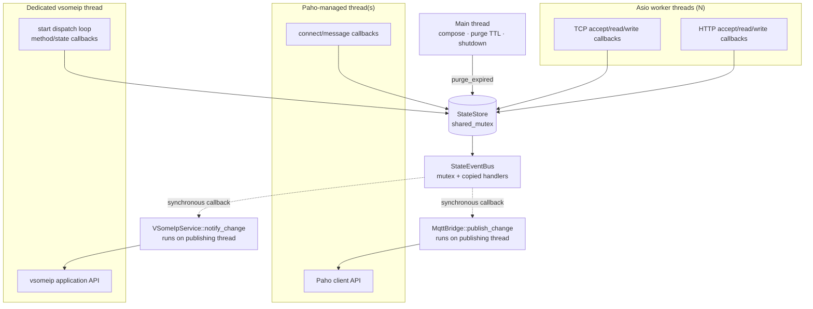

`StateEventBus::publish` gọi handler đồng bộ trên chính thread đã thay đổi
state; nó không tự chuyển callback sang Paho/vsomeip thread. `StateStore` cần
`shared_mutex`; event bus copy danh sách handler rồi nhả mutex trước khi gọi để
tránh giữ khóa qua middleware.

## 11. Startup và shutdown

Câu hỏi cần trả lời: “Thứ tự lifecycle bảo vệ điều gì?”

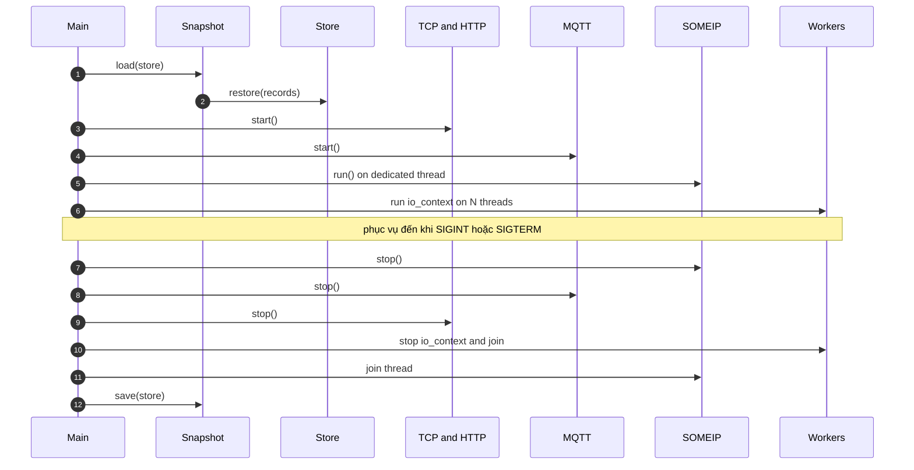

Input được dừng trước khi snapshot cuối được lưu, nên file phản ánh state sau
cùng. Subscription được reset trước khi middleware object dừng để giảm nguy cơ
callback dùng object đang teardown.

## 12. Một state update qua ba kiểu sơ đồ

Cùng sự kiện `HTTP PUT /kv/rpm`, hãy nhớ bằng ba góc nhìn:

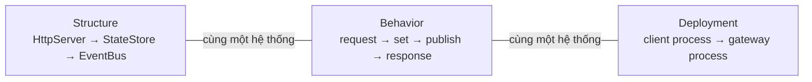

- Không dùng class diagram để suy ra thứ tự thời gian.
- Không dùng sequence diagram để suy ra ownership.
- Không dùng deployment diagram để suy ra business semantics.

Khi tự vẽ được cả ba góc nhìn cho TCP, HTTP, MQTT và SOME/IP, bạn đã hiểu hệ
thống thay vì chỉ nhớ tên class.

## 13. Bài tập đọc UML

1. Chỉ trên component diagram nơi MQTT broker nằm và giải thích vì sao nó không
   thuộc process gateway.
2. Chỉ trên class diagram object nào giữ RAII subscription.
3. Dùng TCP sequence giải thích message boundary.
4. Dùng SOME/IP sequence phân biệt discovery với data exchange.
5. Dùng deployment diagram giải thích vì sao localhost pass chưa đủ.
6. Dùng thread diagram tìm tất cả nguồn có thể đồng thời gọi `StateStore`.
7. Tự thêm luồng `TCP SET → MQTT publish` vào một sequence diagram mới.
