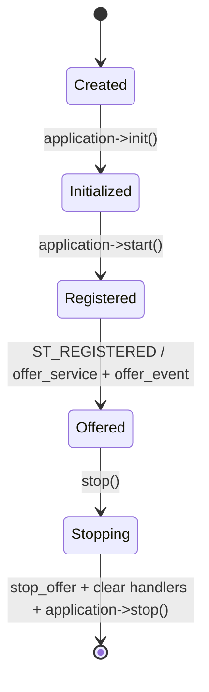

# COVESA vsomeip trong Edge Gateway

## 1. Vì sao dùng vsomeip?

vsomeip là middleware implementation, không chỉ là serializer. Nó quản lý
routing, endpoint, Service Discovery, local communication, request/response và
event subscription. Application chỉ đăng ký service interface.

## 2. Lifecycle



`application->start()` blocking, nên project chạy nó trên thread riêng.

## 3. Mapping source

File `src/adapters/someip/vsomeip_service.cpp`:

1. `runtime::get()->create_application(name)`.
2. `init()`.
3. `register_state_handler`.
4. `register_message_handler` cho GET/SET.
5. Khi `ST_REGISTERED`, gọi `offer_event` và `offer_service`.
6. GET/SET dùng `create_response(request)` để vsomeip giữ đúng request ID.
7. Domain event gọi `application->notify`.
8. Shutdown gọi `stop_offer_event`, `stop_offer_service`,
   `clear_all_handler`, `stop`.

## 4. Configuration

`config/vsomeip-edge-gateway.json` định nghĩa:

- application name/client ID;
- routing manager;
- service/instance và UDP port;
- SD multicast `224.224.224.245:30490`;
- offer repetition, TTL và cyclic delay.

Chạy:

```bash
export VSOMEIP_APPLICATION_NAME=edge-gateway
export VSOMEIP_CONFIGURATION="$PWD/config/vsomeip-edge-gateway.json"
./build/full/edge_gateway
```

Hai ECU thật phải có:

- unicast address khác nhau;
- client ID duy nhất;
- route/interface cho multicast;
- firewall cho SD và service ports;
- service configuration nhất quán.

Config loopback trong repo chỉ dành cho local development.

## 5. Service contract

| Item | ID |
|---|---:|
| State service | `0x1234` |
| State instance | `0x5678` |
| GET | `0x0001` |
| SET | `0x0002` |
| State event | `0x8001` |
| State eventgroup | `0x0001` |

IDs và payload phải được version-control như API contract. Không rải magic
number trong code; chúng nằm trong `SomeIpIds`.

## 6. Bước nâng cấp production

1. Tạo service/client riêng để integration test availability và response.
2. Tách deployment codec theo interface version.
3. Thêm subscription handler và access policy.
4. Thêm E2E protection nếu system design yêu cầu.
5. Dùng CommonAPI/Franca hoặc AUTOSAR generated bindings khi dự án có model.
6. Test trên hai network namespace/ECU thay vì chỉ loopback.

