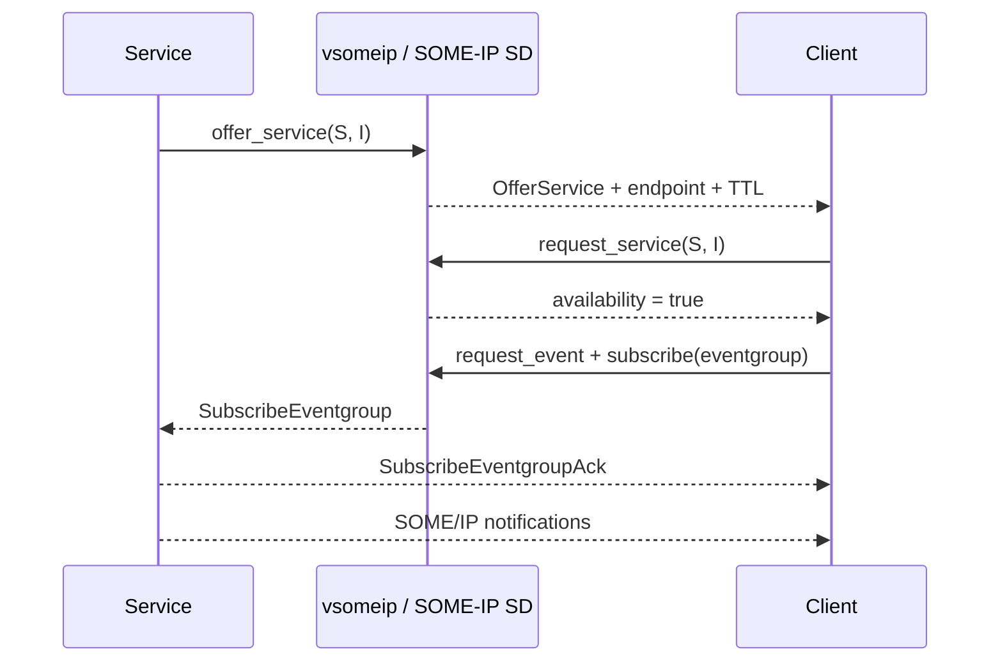
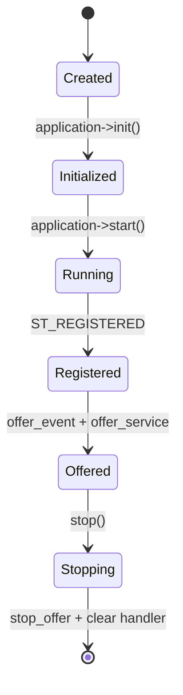

# COVESA vsomeip: từ bản chất đến code trong Edge Gateway

Đọc [nền tảng protocol](PROTOCOLS_VI.md) trước nếu chưa phân biệt được TCP,
SOME/IP, SOME/IP-SD và vsomeip.

## 1. Định nghĩa đúng ngay từ đầu

vsomeip **không phải** một protocol mới và cũng không phải business service.
Nó là C++ middleware triển khai SOME/IP và SOME/IP-SD.

```text
AUTOSAR SOME/IP specification
          ↓ được triển khai bởi
COVESA vsomeip runtime
          ↓ được gọi bởi
VSomeIpService adapter của project
          ↓ chuyển đổi sang
StateStore và StateEventBus
```

vsomeip cố ý không serialize business data thay application. Nó xử lý envelope
SOME/IP, routing và transport; project vẫn phải có payload codec hoặc generated
binding.

## 2. Ba vai trò thường bị nhầm

### Service application

Cung cấp service, đăng ký method handler, gọi `offer_service`, phát event và
trả response. `VSomeIpService` trong project đóng vai trò này.

### Client application

Gọi `request_service`, theo dõi availability, gửi method request, đăng ký
event rồi subscribe eventgroup. Repo hiện chưa có executable client riêng.

### Routing manager

Điều phối application local và endpoint remote. Trong mỗi host thường có một
vsomeip application làm routing manager; application khác giao tiếp với nó qua
local IPC. Routing manager không phải MQTT broker và không chứa business logic.

Nếu service và client chạy cùng máy, message có thể đi qua local IPC thay vì
ra network interface. Vì vậy test “hai process trên localhost” chưa chứng minh
multicast, route, firewall và remote UDP/TCP đều đúng.

## 3. Service Discovery diễn ra thế nào?

Service cần cho client biết: “tôi đang cung cấp service/instance/version này và
endpoint của tôi ở đây”. Client cũng có thể chủ động tìm service.



Các ý quan trọng:

- `OfferService` có TTL; hết TTL mà không được refresh thì offer không còn hợp
  lệ.
- Repetition phase tăng khả năng peer nhận được offer ban đầu trên UDP.
- Cyclic offer refresh duy trì availability.
- Subscribe vào **eventgroup**, sau đó nhận các event thuộc group đã request.
- Service được offer không đồng nghĩa mọi client đều đã subscribe event.

## 4. Lifecycle application



### `create_application(name)`

Tạo application object với tên phải khớp configuration. Tên này không phải
Service ID.

### `init()`

Đọc configuration, thiết lập routing/local endpoint và chuẩn bị runtime. Trả
`false` nghĩa là chưa thể chạy an toàn.

### Đăng ký handler

- state handler nhận trạng thái registration;
- message handler được route bằng service/instance/method;
- subscription handler, availability handler hoặc error handler được dùng theo
  vai trò.

Handler nên được đăng ký trước `start()` để không bỏ lỡ message.

### `start()`

Chạy dispatch loop và **blocking**. Project đặt nó trên thread riêng để Asio,
Paho và main lifecycle vẫn hoạt động. Callback vsomeip không nên làm tác vụ
blocking lâu vì sẽ cản dispatch.

### `ST_REGISTERED`

Cho biết application đã đăng ký với routing component. Project chỉ offer sau
trạng thái này; `init()` thành công chưa có nghĩa service đã visible trên mạng.

### Shutdown

Thứ tự có chủ đích:

1. ngăn domain callback mới gọi middleware;
2. stop offer event/service;
3. clear handler;
4. gọi `application->stop()`;
5. join runtime thread.

Mục tiêu là không để callback dùng object đang bị hủy và không để peer tiếp tục
coi service là available.

## 5. Mapping từng đoạn source

File chính: `src/adapters/someip/vsomeip_service.cpp`.

### Khởi tạo

```text
runtime::get()->create_application(name)
  → application->init()
  → register_state_handler()
  → register_message_handler(GET)
  → register_message_handler(SET)
```

### Offer service và event

Khi nhận `ST_REGISTERED`:

```text
offer_event(service, instance, event, eventgroups, ET_FIELD)
offer_service(service, instance)
```

Event phải được khai báo với eventgroup để client có thể subscribe. `ET_FIELD`
biểu diễn state-like value; notifier gửi cập nhật khi state đổi.

### Xử lý GET

```text
SOME/IP request
  → on_get(request)
  → decode key từ payload
  → StateStore::get(key)
  → encode value
  → create_response(request)
  → set return code và payload
  → send(response)
```

`create_response(request)` sao chép metadata correlation cần thiết, đặc biệt
service/method/client/session. Tự tạo message mới mà quên các ID này có thể làm
client không ghép response với request đang chờ.

### Xử lý SET

```text
SOME/IP request
  → decode key + value
  → StateStore::set(..., someip)
  → response E_OK
```

Payload sai format trả `E_MALFORMED_MESSAGE`; thao tác không thành công trả mã
lỗi phù hợp. Transport nhận được packet không đồng nghĩa request hợp lệ.

### Phát event

```text
StateStore thay đổi
  → StateEventBus callback
  → encode key + value
  → application->notify(service, instance, event, payload)
  → chỉ subscriber phù hợp nhận notification
```

Khi production không muốn phát ngược về chính protocol nguồn, adapter có thể
dùng `origin` trong domain event để đặt policy. Implementation hiện tại vẫn
phát mọi thay đổi sang các output adapter.

## 6. Service contract không chỉ là bảng ID

Contract đầy đủ cần thống nhất:

- Service ID và Instance ID;
- Method/Event/Eventgroup ID;
- major/minor interface version;
- request/response/event payload schema;
- byte order, range, optional field và string encoding;
- return code/application error;
- TCP hay UDP, port và message size;
- event behavior, cycle/change policy;
- compatibility khi nâng version.

Contract minh họa của project:

| Item | ID |
|---|---:|
| State service | `0x1234` |
| State instance | `0x5678` |
| GET | `0x0001` |
| SET | `0x0002` |
| State event | `0x8001` |
| State eventgroup | `0x0001` |

Payload:

```text
string = uint16 big-endian length + bytes
GET    = string(key)
SET    = string(key) + string(value)
event  = string(key) + string(value)
```

`uint16 big-endian` nghĩa là độ dài `0x0123` đi trên wire dưới dạng byte
`01 23`. Codec phải kiểm tra buffer còn đủ byte trước khi đọc length/payload,
và phải từ chối trailing/malformed data theo contract.

IDs nằm trong `SomeIpIds`, không rải magic number. Tuy nhiên centralize constant
chưa thay thế interface specification và compatibility test.

## 7. Đọc configuration bằng mô hình tinh thần

`config/vsomeip-edge-gateway.json` trả lời bốn nhóm câu hỏi:

1. **Identity**: application name/client ID là gì?
2. **Routing**: application nào làm routing manager?
3. **Service endpoint**: service/instance chạy IP, port, TCP/UDP nào?
4. **Discovery**: multicast address/port, protocol, TTL và timer nào?

Các biến môi trường chọn application/config:

```bash
export VSOMEIP_APPLICATION_NAME=edge-gateway
export VSOMEIP_CONFIGURATION="$PWD/config/vsomeip-edge-gateway.json"
./build/full/edge_gateway
```

Đừng nhầm ba loại ID:

- application name/client ID nhận diện vsomeip application;
- service/instance nhận diện API được cung cấp;
- IP/port nhận diện network endpoint.

Hai ECU thật cần:

- unicast IP khác nhau và route đúng;
- client ID không xung đột;
- network interface hỗ trợ multicast;
- firewall mở SD port và service port;
- deployment config/contract nhất quán;
- clock/timer và TTL hợp lý.

Config loopback trong repo chỉ chứng minh local development path.

## 8. Debug theo tầng

Không thấy service:

1. application có đạt `ST_REGISTERED` không?
2. tên application/config có khớp không?
3. routing manager có chạy không?
4. `offer_service` có được gọi không?
5. multicast route/interface/firewall có đúng không?
6. client có request đúng service/instance/version không?

Thấy service nhưng method timeout:

1. endpoint TCP/UDP và port có khớp không?
2. handler có đăng ký đúng service/instance/method không?
3. request có đúng message type không?
4. payload decoder có từ chối dữ liệu không?
5. response có giữ client/session ID không?
6. callback có bị block hoặc exception không?

Method chạy nhưng không có event:

1. service đã `offer_event` chưa?
2. client đã `request_event` chưa?
3. client subscribe đúng eventgroup chưa?
4. subscription đã ACK và chưa hết TTL chưa?
5. `notify` có dùng đúng service/instance/event không?
6. event type/cycle/change policy có đúng không?

Quy tắc debug: xác minh lần lượt **lifecycle → discovery → transport → SOME/IP
header → payload → domain**, không thay config ngẫu nhiên.

## 9. Những hiểu lầm hay gặp trong phỏng vấn

**“vsomeip là serializer.”**

Chưa đủ. Nó xử lý SOME/IP envelope và middleware concerns, nhưng business
payload cần codec/generated binding.

**“SOME/IP luôn chạy UDP.”**

Sai. Service deployment có thể dùng TCP hoặc UDP; SD thường dùng UDP.

**“Offer service là client đã dùng được event.”**

Sai. Client còn phải request event và subscribe eventgroup.

**“Service ID là port.”**

Sai. Service ID là logical interface identifier; configuration ánh xạ service
sang network endpoint.

**“Chạy được localhost là network setup đúng.”**

Sai. Local IPC có thể che khuất lỗi multicast, firewall và routing.

**“`start()` khởi động xong rồi trả về.”**

Sai trong vsomeip: nó là dispatch loop blocking, nên project chạy thread riêng.

## 10. Bài tập để nhớ lâu

1. Vẽ tay request GET từ client tới `StateStore`, ghi rõ SD chỉ tham gia bước
   discovery chứ không mang business request.
2. Viết client gọi GET/SET và in service availability.
3. Subscribe eventgroup, thay state qua HTTP rồi quan sát SOME/IP notification.
4. Cố ý đổi Method ID phía client và dự đoán kết quả trước khi chạy.
5. Cố ý encode length little-endian để quan sát decoder trả malformed.
6. Chạy service/client ở hai network namespace để buộc traffic đi qua network.
7. Capture traffic bằng Wireshark, phân biệt SD packet và SOME/IP message.

## 11. Nâng cấp production

1. Dùng generated binding từ Franca/CommonAPI hoặc AUTOSAR model.
2. Version hóa interface và deployment contract.
3. Thêm payload/range validation và giới hạn message size.
4. Thêm subscription/access policy.
5. Áp dụng E2E protection nếu safety architecture yêu cầu.
6. Có integration test availability, method, error và notification.
7. Test restart, TTL expiry, duplicate/loss và routing manager failure.
8. Đo callback latency; không block dispatch thread.

## 12. Bộ câu hỏi phỏng vấn tự luyện

1. Phân biệt SOME/IP, SOME/IP-SD và vsomeip.
2. Routing manager làm gì khi hai application cùng host?
3. Vì sao `application->start()` cần thread riêng trong project?
4. `ST_REGISTERED` có ý nghĩa gì?
5. Offer service, request service và subscribe eventgroup khác nhau ra sao?
6. Method ID và Event ID được route thế nào?
7. Tại sao vsomeip không đủ để hai ECU hiểu payload?
8. `create_response(request)` bảo toàn thông tin nào?
9. Vì sao local test có thể pass nhưng hai ECU không thấy nhau?
10. Bạn debug “có response nhưng không có event” theo thứ tự nào?

Nếu trả lời được bằng cơ chế, giới hạn và ví dụ source thay vì một câu định
nghĩa, bạn đã nắm được bản chất.
